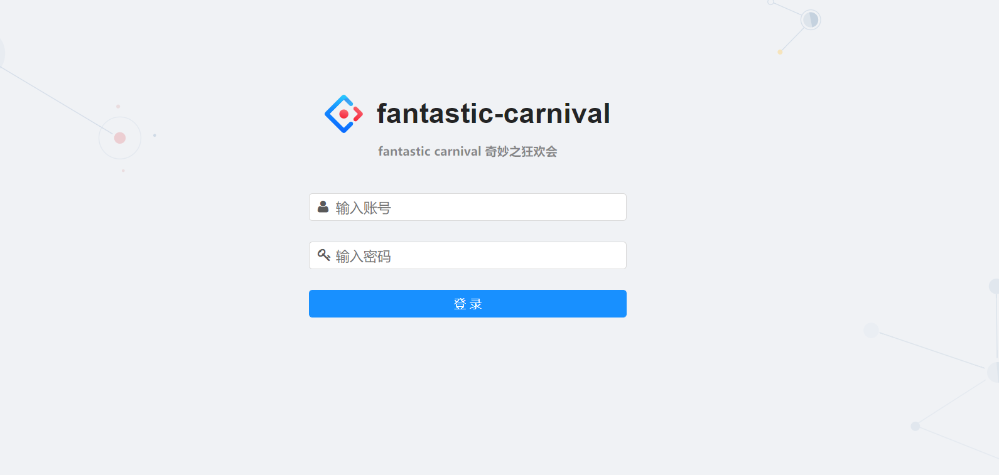
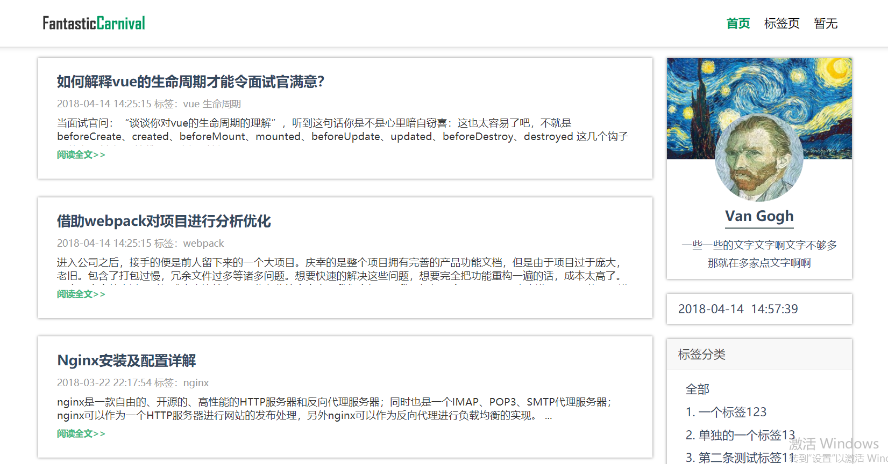

<br>
<p align="center">
  
</p>
<br>

这是一个后端`koa@2`、前端分别是`react`和`vue`完成的一整套博客系统，包含后台管理录入页面和展示页面。

## 结构

暂时还是前端渲染的`spa`，`server`端返回一个`Html`,`js`去动态生成页面，后期可能会考虑用`next.js`去重构`react`项目以及用`nuxt.js`重构`vue`项目。

项目总结：

1. [后端](https://github.com/limengke123/fantastic-carnival/blob/master/server/README.md)
2. [client](https://github.com/limengke123/fantastic-carnival/blob/master/client/readme.md)
3. [admin](https://github.com/limengke123/fantastic-carnival/blob/master/admin/README.md)

`client`分成两块：

### 1. admin-page

博客的后台录入页面，也是文章的管理页面，有登录权限控制。



<details><summary>其他截图</summary><br>
<p>编辑页面</p>   

<br>
<p>标签页面</p>

<br>
</details>

### 2. client-page

博客的展示页面



<details><summary>其他截图</summary><br>

<br>
</details>

开发采用`webpack-dev-server`开发，代理转发到本地起的`localhost:3333/api`下的`REST`接口
生产模式打包后的文件，放置在`server`的`static`目录下

## 要求

`server`用到了`async/await`，`node>=7.6`
需要安装`mongodb`

## 启动

* 开启`Mongodb`服务
* 安装依赖

```bash
npm i
```

* server

```bash
npm run dev-server
```

访问`localhost:3333`

* admin-page

```bash
npm run dev-admin
```

访问`localhost:8000`
打包：

```bash
npm run build-admin
```

* client-page

```bash
npm run dev-client
```

访问`localhost:8001`
打包：

```bash
npm run build-client
```

* 开发模式

    开启`server`，用`webpack-dev-server`开发，请求代理到`server`

* 生产模式

    打包后，访问：

        1. admin-page:
            `localhost:3333/admin`
        2. client-page:
            `localhost:3333/client`

## server

`koa`、`koa-router`、`koa-static`，`mongoose`驱动`mongodb`，参考用切面（`aop`）方式处理请求。

server地址:
[https://github.com/limengke123/fantastic-carnival/tree/master/server](https://github.com/limengke123/fantastic-carnival/tree/master/server)

server项目总结：
[https://github.com/limengke123/fantastic-carnival/blob/master/server/README.md](https://github.com/limengke123/fantastic-carnival/blob/master/server/README.md)

## admin-page

`vue`全家桶：

`vue`、`vue-router`、`vuex`、`axios`

编辑器用`simplemde`,默认样式好看，功能丰富

admin-page地址：
[https://github.com/limengke123/fantastic-carnival/tree/master/admin](https://github.com/limengke123/fantastic-carnival/tree/master/admin)

admin项目总结：
[https://github.com/limengke123/fantastic-carnival/blob/master/admin/README.md](https://github.com/limengke123/fantastic-carnival/blob/master/admin/README.md)

## client-page

`react`全家桶：

`react`、`react-router`、`mobx`、`axios`

client-page地址：
[https://github.com/limengke123/fantastic-carnival/tree/master/client](https://github.com/limengke123/fantastic-carnival/tree/master/client)

client项目总结：
[https://github.com/limengke123/fantastic-carnival/blob/master/client/readme.md](https://github.com/limengke123/fantastic-carnival/blob/master/client/readme.md)